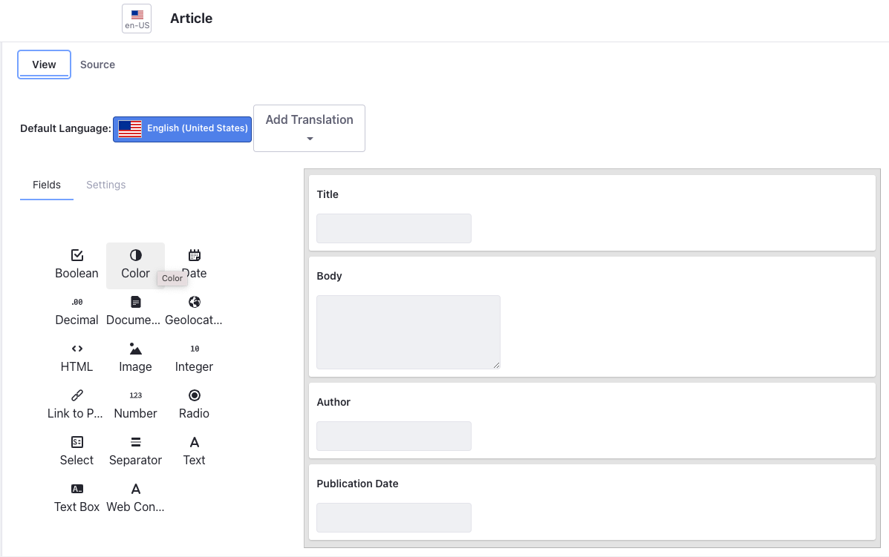
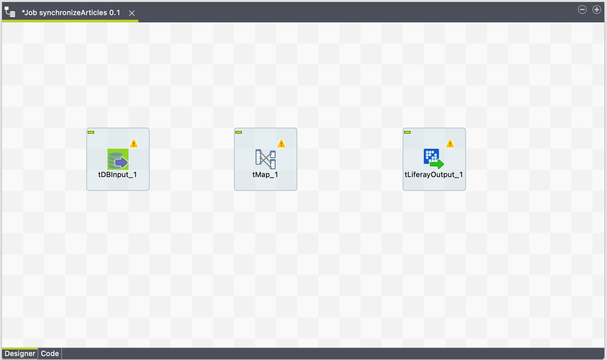
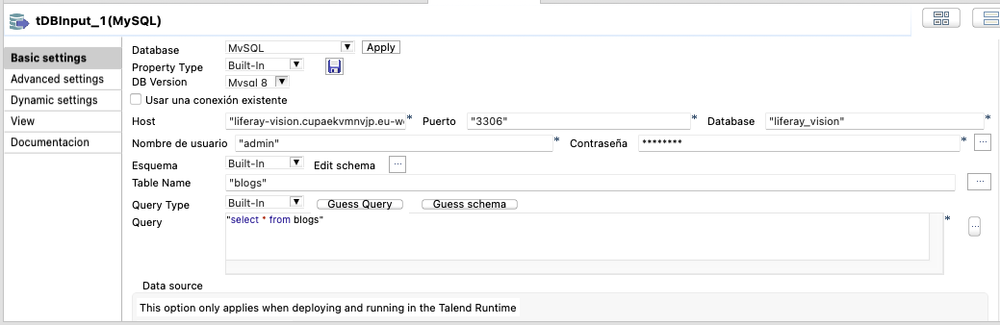
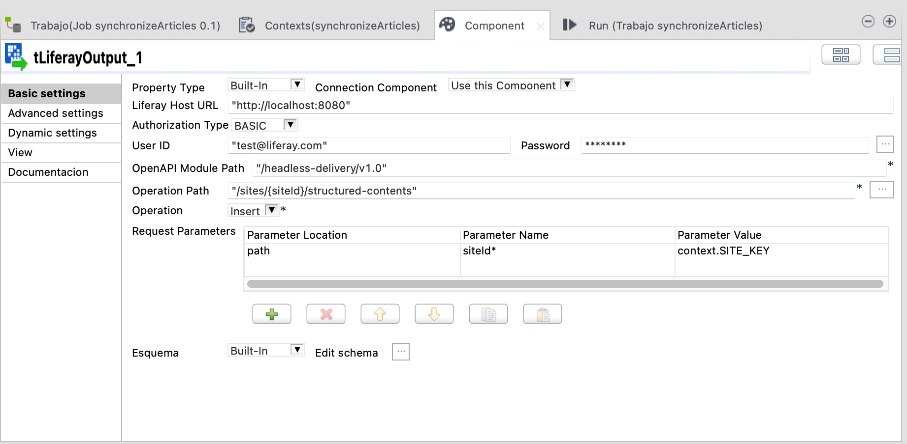
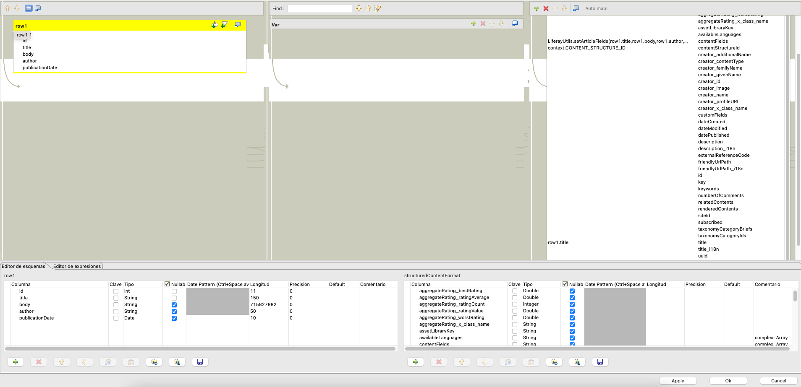
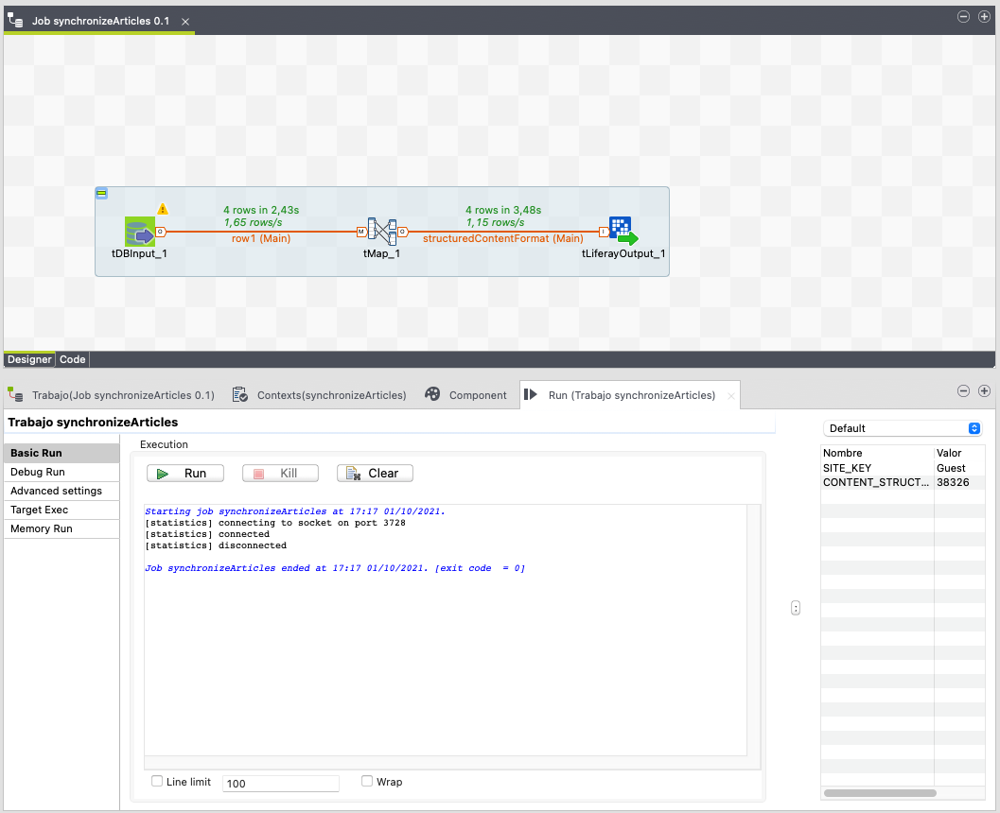
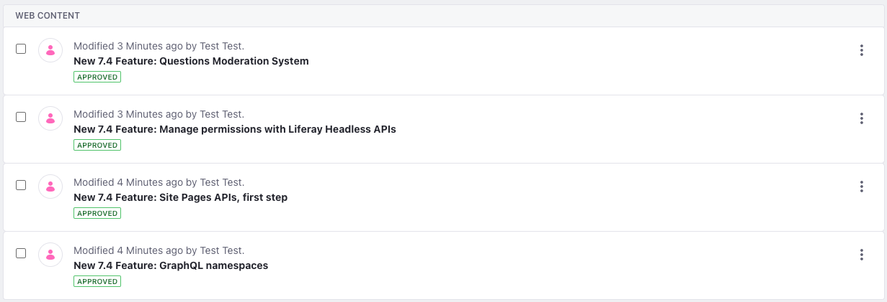

# Liferay Vision: Leverage Liferay DXP as the Foundation in your interconnected enterprise landscape

On this repo you will find the resources used in the demo shown in the **Liferay Vision 2021** talk with the same name.

The demo purpose is to show how you can easily use **Liferay** and ETL tools to integrate with other systems or use external data sources.

## Prerequisites

The prerequisites to follow the demo are:
- [Java 8](https://adoptium.net/?variant=openjdk8&jvmVariant=hotspot)
- [Blade](https://learn.liferay.com/dxp/latest/en/developing-applications/tooling/blade-cli/installing-and-updating-blade-cli.html)
- [Talend Open Studio](https://www.talend.com/products/talend-open-studio/)
- [Liferay Talend Connector](https://github.com/liferay/liferay-portal/tree/master/modules/etl/talend)
- A MySQL based database, cloud hosted or locally installed.

## Prepare the database

We have used [Amazon RDS](https://aws.amazon.com/rds/?nc1=h_ls) to host a MySQL database on the cloud, to synchronize the data in Liferay using an ETL tool, in this case, Talend.

We have used a MySQL db.t2.micro database of 10 GB using the AWS free tier.

You can use another hosted database or use your machine. The only step that will change is the configuration of the Database Input component in Talend, where you should add your specific host URL and port.

To create the database you can use the [liferay_vision.sql](database/liferay_vision.sql) file inside the database folder, which will create the **liferay-vision** database with a **blogs** table and sample data.

## Prepare Liferay

We have used [blade](https://help.liferay.com/hc/es/articles/360018164591-Blade-CLI-) to create the Liferay Workspace. It is commited on the liferay-workspace folder and it is created with the blade init command, selecting the _portal-7.3-ga8_ version.

Once you have cloned the repo, you should go to this folder and execute `blade server init` to init the server. Then you can start **Liferay** running the [startup.sh](liferay-workspace/bundles/tomcat-9.0.43/bin/startup.sh) script inside the _bundles/tomcat-9.0.43/bin_ folder.

After configuring your instance, you should create a structure like the following goint to the Menu > Content & Data > Web Content > Structures

It should have:
- A text field with the name _title_
- A text box with the name _body_
- A text field with the name _author_
- A date field with the name _publicationDate_

## Creating and executing the Talend job

First you will need to install [Talend Open Studio](https://www.talend.com/products/talend-open-studio/) and the [Liferay Talend Connector](https://github.com/liferay/liferay-portal/tree/master/modules/etl/talend) following the [README](https://github.com/liferay/liferay-portal/tree/master/modules/etl/talend/README.md) instructions.

Then we will create the job to synchronize the database data with Liferay. You will need three components: tDBInput, tMap and tLiferayOutput. 

1. Create a new job, search and drag and drop the three components to your job.

2. Configure your tDBInput with MySQL type, host, port, database, username and password. Then click on the _..._ button at the right of the table name to select **blogs**. Type `select * from blogs` in the query text box and click _Guess schema_. It should looks similar to the following image.

3. Create a link from your tDBInput component to the tMap.
4. Configure your tLiferayOutput component with your Liferay instance settings. Complete the HostURL, user id, password and type _/headless-delivery/v1.0_ in the OpenAPI Module Path. Click on the _..._ button at the right of the operation path and select the _sites/{siteId}/structured-contents_ endpoint. Complete the Parameter Value of the siteId request parameter to _context.SITE_KEY. It is important that you also go to the Advanced settings tab to add values to the timeout parameters to avoid errors. Your component should look something like:

5. Create a link from the tMap component to the tLiferayOutput component. Accept the dialog to use the liferay output schema.
6. Create a new routine called LiferayUtils and copy and paste the code inside the [LiferayUtils.java](talend/LiferayRoutines.java) class
7. Configure tue tMap component assigning `context.CONTENT_STRUCTURE_ID` to the contentStructureId field, `row1.title` to the title field and `LiferayUtils.setArticleFields(row1.title,row1.body,row1.author,row1.publicationDate)` to the contentFields field.

8. Create the context variables in the context tab. The **SITE_KEY** variable with the `Guest` value and the **CONTENT_STRUCTURE_ID** variable with the value of the id of the structure that you created preparing the Liferay Environment.
9. Run the job on the Run tab. Your job should succeed synchronizint 4 rows

10. Now you can see your articles in Liferay

_**Info** In case you have problems following the demo you can import the project using the Import existing project option in Talend and selecting the [LIFERAY_VISION_PROJECT](talend/LIFERAY_VISION_PROJECT) folder_
